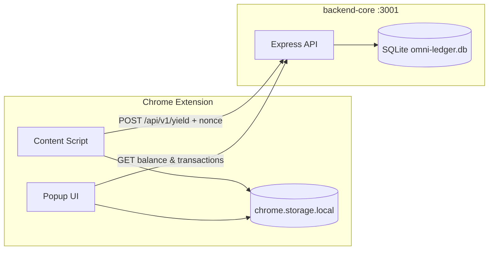

# Omni Protocol — AI Wait-Time Dividend

**OmniPiggy** is a proof-of-concept stack that turns idle AI wait time into micro-yield. A Chrome extension detects when supported chat platforms are generating a response, offers a **Mindful Break** dividend claim, and syncs earnings with a local **Omni Bank** backend backed by SQLite.

| Component | Path | Stack |
|-----------|------|-------|
| Backend API | `backend-core/` | Node.js, Express, better-sqlite3 |
| Chrome extension | `client-extension/` | React 18, Vite 6, Tailwind CSS, Manifest V3 |

---

## Features

- **Behavioral yield** — Content script watches ChatGPT and Claude for active generation; users can claim a $0.10 mindful-break dividend per wait cycle.
- **SQLite ledger** — Persistent balances and transaction history with nonce-based idempotency (no double-credits on retry).
- **Popup dashboard** — Live wallet balance, protocol layer toggles, and recent activity feed.
- **Graceful offline handling** — Extension surfaces "Bank offline" states and allows claim retries when the backend is unreachable.

---

## Architecture



### Request flow (claim dividend)

1. User waits while an AI model generates a response on a supported site.
2. Content script injects the **Mindful Break** overlay with a claim button.
3. On click, the extension `POST`s to `/api/v1/yield` with `userId`, `amount`, `layer`, and a unique `nonce` (`crypto.randomUUID()`).
4. Backend atomically inserts the transaction and credits the user balance inside a SQLite transaction.
5. Extension updates local storage; popup reads the authoritative balance from the API when online.

---

## Project structure

```
Omni-protocol-AI-Waittime/
├── backend-core/
│   ├── src/
│   │   ├── server.ts      # Express routes & validation
│   │   └── db.ts          # SQLite schema, applyYield, queries
│   ├── package.json
│   └── tsconfig.json
├── client-extension/
│   ├── public/
│   │   └── manifest.json  # MV3 manifest (ChatGPT + Claude)
│   ├── src/
│   │   ├── content/
│   │   │   └── content.ts # Wait-state detection & claim UI
│   │   └── popup/
│   │       ├── App.tsx    # Balance, layers, recent activity
│   │       ├── main.tsx
│   │       └── index.css
│   ├── popup.html
│   ├── vite.config.ts     # Dual build: popup + content IIFE
│   └── package.json
├── .gitignore
└── README.md
```

---

## Prerequisites

- **Node.js** ≥ 20
- **npm** ≥ 9
- **Google Chrome** (or Chromium) for loading the unpacked extension
- A C/C++ toolchain may be required on first install for `better-sqlite3` native bindings

---

## Quick start

### 1. Start the backend

```bash
cd backend-core
npm install
npm run dev
```

The API listens on **http://localhost:3001** by default. On first run, SQLite creates `omni-ledger.db` in the `backend-core` working directory.

Verify:

```bash
curl http://localhost:3001/health
```

### 2. Build the extension

```bash
cd client-extension
npm install
npm run build
```

Output is written to `client-extension/dist/` (popup bundle + `content.js` + copied `manifest.json`).

### 3. Load in Chrome

1. Open `chrome://extensions`
2. Enable **Developer mode**
3. Click **Load unpacked**
4. Select the `client-extension/dist` folder

### 4. Try it

1. Visit [chatgpt.com](https://chatgpt.com) or [claude.ai](https://claude.ai)
2. Send a prompt and wait for generation to start
3. Click **Claim $0.10 Dividend** on the Mindful Break overlay
4. Open the OmniPiggy popup to see balance and recent activity

---

## API reference

Base URL: `http://localhost:3001`

### `GET /health`

Liveness check.

```json
{
  "status": "ok",
  "service": "omni-backend-core",
  "timestamp": "2026-07-02T22:00:00.000Z"
}
```

### `POST /api/v1/yield`

Credit yield to a user. Requires a unique **nonce** per user to prevent duplicate credits.

**Request body**

| Field | Type | Required | Description |
|-------|------|----------|-------------|
| `userId` | string | yes | User identifier (max 128 chars) |
| `amount` | number | yes | Positive USD amount (max 1,000,000) |
| `layer` | string | yes | One of the protocol layers (see below) |
| `nonce` | string | yes | Unique idempotency key (max 128 chars) |

**Example**

```bash
curl -X POST http://localhost:3001/api/v1/yield \
  -H "Content-Type: application/json" \
  -d '{
    "userId": "user-001",
    "amount": 0.1,
    "layer": "behavioralLayer",
    "nonce": "550e8400-e29b-41d4-a716-446655440000"
  }'
```

**Success — `200`**

```json
{
  "success": true,
  "message": "Yield transaction processed successfully.",
  "data": {
    "userId": "user-001",
    "creditedAmount": 0.1,
    "layer": "behavioralLayer",
    "previousBalance": 0,
    "updatedBalance": 0.1,
    "processedAt": "2026-07-02T22:00:00.000Z"
  }
}
```

**Duplicate nonce — `409`**

```json
{
  "success": false,
  "message": "This transaction nonce has already been processed."
}
```

### `GET /api/v1/balance/:userId`

```json
{
  "success": true,
  "data": {
    "userId": "user-001",
    "balance": 0.1
  }
}
```

### `GET /api/v1/transactions/:userId?limit=N`

Returns the most recent transactions for a user. `limit` defaults to 25, capped at 100.

```json
{
  "success": true,
  "data": {
    "userId": "user-001",
    "transactions": [
      {
        "id": 1,
        "user_id": "user-001",
        "amount": 0.1,
        "layer": "behavioralLayer",
        "nonce": "550e8400-e29b-41d4-a716-446655440000",
        "created_at": "2026-07-02 22:00:00"
      }
    ]
  }
}
```

`created_at` is a UTC datetime string from SQLite in `YYYY-MM-DD HH:MM:SS` format.

---

## Protocol layers

The extension and API recognize three yield layers:

| Layer key | Display name | Purpose |
|-----------|--------------|---------|
| `activeAiLayer` | Active AI Layer | Earn while AI models generate responses |
| `behavioralLayer` | Behavioral Layer | Mindful wait-time signals from chat sessions |
| `passiveDepinLayer` | Passive DePIN Layer | Background network participation (future) |

The content script currently claims against `behavioralLayer`. Layer toggles in the popup are persisted to `chrome.storage.local` for future routing logic.

---

## Database schema

SQLite file: `backend-core/omni-ledger.db` (auto-created, gitignored)

**`users`**

| Column | Type | Notes |
|--------|------|-------|
| `user_id` | TEXT PK | |
| `balance` | REAL | Rounded to 2 decimal places |
| `created_at` | TEXT | SQLite `datetime('now')` |

**`transactions`**

| Column | Type | Notes |
|--------|------|-------|
| `id` | INTEGER PK | Auto-increment |
| `user_id` | TEXT FK | References `users` |
| `amount` | REAL | |
| `layer` | TEXT | Protocol layer key |
| `nonce` | TEXT | Unique per `(user_id, nonce)` |
| `created_at` | TEXT | UTC timestamp |

`applyYield()` runs insert + balance credit inside a single SQLite transaction. Duplicate nonces raise `DuplicateTransactionError`.

---

## Extension details

### Supported sites

Defined in `client-extension/public/manifest.json`:

- `https://chatgpt.com/*`
- `https://claude.ai/*`

### Permissions

- `storage` — local earnings and layer preferences
- `host_permissions: http://localhost:3001/*` — API access to Omni Bank

### Default user ID

Both the content script and popup use `user-001` as the demo user identifier.

### Content script behavior

- Observes DOM mutations to detect generation state (stop buttons, disabled submit controls, streaming indicators).
- Shows a fixed-position **Mindful Break** card once per wait cycle.
- Claim requests time out after 5 seconds; failures show **Bank offline — Retry**.
- Successful claims animate out and remove the overlay after 2 seconds.

### Popup behavior

- Fetches balance from `GET /api/v1/balance/user-001`, falling back to `chrome.storage.local` when offline.
- Loads the 10 most recent transactions on open.
- Renders relative timestamps (e.g. `2m ago`) from UTC `created_at` values.

---

## Configuration

### Backend environment variables

Create `backend-core/.env` (optional):

| Variable | Default | Description |
|----------|---------|-------------|
| `PORT` | `3001` | HTTP listen port |

Example:

```env
PORT=3001
```

---

## Development

### Backend scripts

| Command | Description |
|---------|-------------|
| `npm run dev` | Start with hot reload (`tsx watch`) |
| `npm run build` | Compile TypeScript to `dist/` |
| `npm run start` | Run compiled `dist/server.js` |
| `npm run typecheck` | Type-check without emit |

### Extension scripts

| Command | Description |
|---------|-------------|
| `npm run dev` | Watch mode rebuild |
| `npm run build` | Production build to `dist/` |
| `npm run typecheck` | Type-check only |

After changing extension source, run `npm run build` and click **Reload** on `chrome://extensions`.

---

## Troubleshooting

| Issue | Fix |
|-------|-----|
| `EADDRINUSE` on port 3001 | Another process is using the port. Stop it or set `PORT` in `.env`. |
| Extension shows "Bank offline" | Ensure `npm run dev` is running in `backend-core` and reachable at `localhost:3001`. |
| `better-sqlite3` install fails | Install build tools (Visual Studio Build Tools on Windows, Xcode CLI on macOS). |
| Mindful Break box never appears | Confirm you're on a supported URL and generation is active (stop button visible). |
| Balance mismatch | Popup prefers API balance when online; content script also writes to `chrome.storage.local` on claim. |

---

## Security notes

This is a **local development prototype**:

- No authentication on API routes
- Hard-coded demo `userId`
- CORS allows any origin
- Backend binds to localhost only in typical dev use

Do not expose this stack to the public internet without adding auth, rate limiting, and HTTPS.

---

## Roadmap

- [ ] User authentication and per-browser identity
- [ ] Active AI and Passive DePIN layer yield hooks
- [ ] Production deployment and remote Omni Bank
- [ ] Additional chat platform matchers

---

## License

Private / portfolio project. All rights reserved unless otherwise specified by the repository owner.
